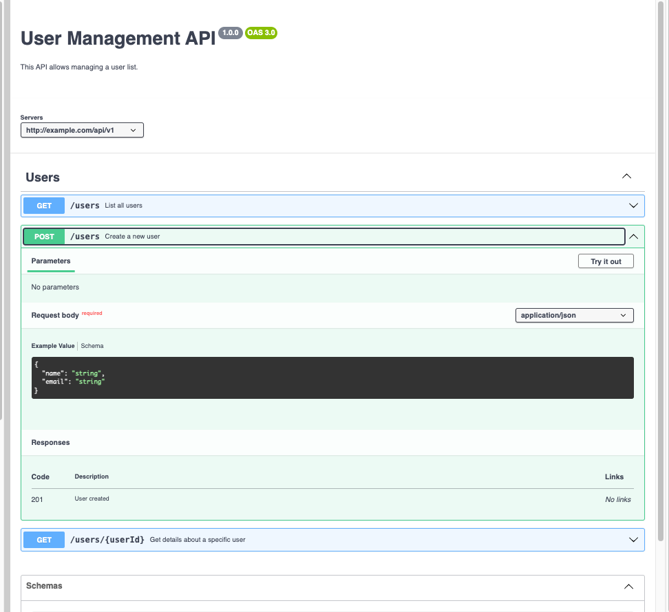

<!-- Begin README -->

    
    &nbsp;
    

 

    
    
     
    
    
    
     
    

---------------

<h1 align="center">Swagger UI + OpenAPI Specification   User Management Demo</h1>

    
     
    <i>Harnessing the power of Swagger & OAS</i>

 

This demo project showcases the implementation of a User Management API documented with Swagger UI and defined using the OpenAPI Specification (OAS). It demonstrates the creation of interactive API documentation that allows for easy exploration and testing of API endpoints directly through the browser.

Swagger UI provides a dynamic interface for visualizing and interacting with the API's capabilities, such as user creation, listing, and retrieval, without writing code. The use of OAS ensures that the API design is standardized, making it clear and understandable, which facilitates efficient integration and enhances developer experience.

> [!NOTE]
> *You can build OAS files in either YAML or JSON then use Swagger UI to view the specifications.*

Key aspects include:

- **Interactive Documentation:** Swagger UI offers an engaging way to understand and test the API.
- **Standardization:** The OpenAPI Specification promotes clear and consistent API design principles.
- **Developer Efficiency:** Streamlines integration efforts with comprehensive documentation.
- **Security and Scalability:** Focuses on secure and scalable API design from the ground up.

This demo project illustrates the power of combining Swagger UI and OAS to create well-documented, easily navigable, and developer-friendly API documentation.

    
     
    <i>My demo YAML file in Swagger UI</i>

 

    
     
    <i>Swagger UI's more robust demo</i>

 

---------------

## Table of Contents

- [Getting Started](#getting-started)
- [Resources](#resources)
- [License](#license)
- [Credits](#credits)

## Getting Started

- Copy the `user-management-api.yaml` file into [Swagger Editor](https://editor.swagger.io/) to view the Swagger UI documentation.
- To run on local, I copied the `dist` folder from the [Swagger UI Repository](https://github.com/swagger-api/swagger-ui/tree/master), and adjusted the `swagger-initilizer.js` file to point to my `user-management-api.yaml` file (Requires disabling CORS policy for your browser).
- Consult the resources section below for more information on Swagger and OAS for APIs.

## Resources

**Technologies:**
- [OpenAPI Initiative](https://www.openapis.org/)
- [Swagger OpenAPI Specification](https://swagger.io/specification/)
- [Swagger](https://swagger.io/)
- [Swagger Editor](https://editor.swagger.io/)
- [Swagger Next Editor](https://editor-next.swagger.io/)
- [Swagger UI Download](https://swagger.io/tools/swagger-ui/download/)
- [Swagger UI Repository](https://github.com/swagger-api/swagger-ui/tree/master)
- [Swagger UI Official Demo](https://petstore.swagger.io/)

**OAS/Swagger Alternatives:**
- [DapperDox](http://dapperdox.io/)
- [RAML](https://raml.org/)
- [README Hub](https://readme.com/)
- [Stoplight](https://stoplight.io/)
- [Apiary](https://apiary.io/)

## License

This project is released under the terms of **The Unlicense**, which allows you to use, modify, and distribute the code as you see fit. 
- [The Unlicense](https://choosealicense.com/licenses/unlicense/) removes traditional copyright restrictions, giving you the freedom to use the code in any way you choose.
- For more details, see the [LICENSE](LICENSE) file in this repository.

## Credits

**Author:** [Scott Grivner](https://github.com/scottgriv)  
**Email:** [scott.grivner@gmail.com](mailto:scott.grivner@gmail.com)  
**Website:** [scottgrivner.dev](https://www.scottgrivner.dev)  
**Reference:** [Main Branch](https://github.com/scottgriv/swagger-openapi-user_management_demo)  

---------------

    

<!-- End README -->
